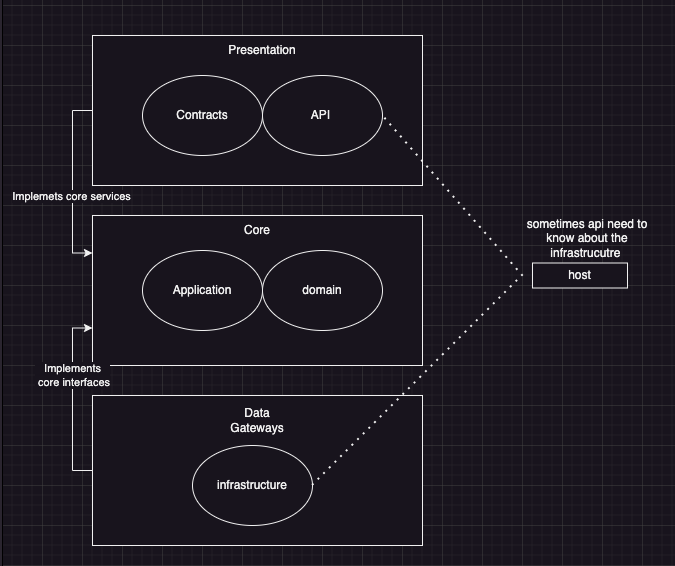

# CLEAN Architecture practise

## Project diagram 


# Setup 

--skip 
</br> 
0 create secret for a project example
```
dotnet user-secrets init --project BbDinner.Api
```

1. create secret `dotnet user-secrets set --project BbDinner.Api "JwtSettings:Secret" "super-secret-key-super-secret-key-2"`


# Run 
start the api
`dotnet run --project BbDinner.Api`